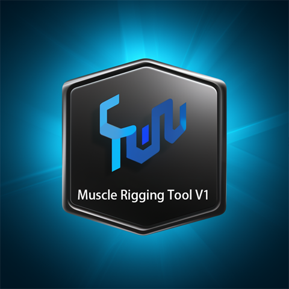

# Maya Muscle Binding Plugin

## Introduction

The Maya Muscle Binding Plugin is designed to emulate Maya's native muscle system, streamlining the process of muscle binding for character rigs. With this plugin, users can effortlessly create, manage, and adjust muscle bindings, enhancing efficiency and ensuring natural and realistic muscle deformations.

## Features

- **Easy Installation**: Drag and drop `DragToInstall.py` into Maya to automatically add a plugin button to the toolbar.
- **Flexible Muscle Parameter Settings**:
  - Select **Start Joint** and **End Joint**
  - Set muscle **Width**, **Height**, and **Number of Joints**
  - Choose whether to enable **Translate**, **Rotate**, and **Scale** controls
- **Muscle Bones with Red Controllers**:
  - Create muscle bones equipped with red controllers for easy identification and manipulation.
  - Controllers manage the muscle bones' translation, rotation, and scaling, with selectable constraint types.
- **Set Squeeze and Set Stretch States**:
  - **Set Squeeze**: Save the current muscle shape as the latest squeeze state.
  - **Set Stretch**: Save the current muscle shape as the latest stretch state.
  - Allows multiple adjustments to achieve the desired squeeze and stretch forms.
  - Provides real-time feedback to ensure natural and accurate muscle deformations.
- **Connect Muscle to Skin**:
  - **Connect Muscle**: Adds the adjusted muscle bones to the skin cluster of the affected mesh.
  - Simplifies the process of binding muscle bones to the model.
- **Automatic Mirroring**: Supports symmetrical muscle mirroring to ensure consistency between left and right muscles.
- **Safe Deletion**: Offers options to clear the current muscle or all muscle bindings, ensuring related skin clusters are removed beforehand to prevent affecting other bindings.

## Installation Guide

### Installation Steps

1. **Download the Plugin**:
   - Download the latest version of the plugin code from the [GitHub repository](https://github.com/YourRepositoryLink).

2. **Drag and Drop Installation**:
   - Open Autodesk Maya.
   - Drag and drop the `DragToInstall.py` file from your file manager into the Maya viewport.
   - Upon successful installation, a new plugin button with the `muscle.png` icon will automatically appear in the current toolbar (Shelf).

## Usage

### Launch the Plugin

1. **Open the Plugin Interface**:
   - Click the "Muscle system Tools" button in the toolbar to open the plugin's user interface.

### Create Muscle Bindings

1. **Select Joints**:
   - **Start Joint**: Click the "Select" button and choose the model's starting joint.
   - **End Joint**: Click the "Select" button and choose the model's ending joint.

2. **Set Muscle Parameters**:
   - **Width**: Enter the muscle's horizontal expansion value.
   - **Height**: Enter the muscle's vertical thickness value.
   - **Number of Joints**: Enter the number of joints along the muscle path.

3. **Choose Control Attributes**:
   - Check the "Translate", "Rotate", and "Scale" options to determine how the controller will influence the muscle.

4. **Create Muscle**:
   - Click the "Create Muscle" button. The plugin will generate muscle bindings based on the settings, including muscle bones with red controllers, joint chains, muscle shapes, and constraints.

### Dynamically Adjust Muscle Shapes

1. **Select the Red Controller**:
   - In the viewport, select the generated red controller.

2. **Adjust the Muscle**:
   - **Squeeze State**:
     - Move, rotate, and scale the controller to achieve the desired muscle squeeze shape.
     - After adjustments, click the "Set Squeeze" button to save the current shape as the latest squeeze state.
   - **Stretch State**:
     - Move, rotate, and scale the controller to achieve the desired muscle stretch shape.
     - After adjustments, click the "Set Stretch" button to save the current shape as the latest stretch state.

3. **Real-Time Preview**:
   - Switch between squeeze and stretch states to preview the muscle's shape changes in real-time, ensuring they meet your expectations.

### Connect Muscle to Skin

1. **Adjust Muscle Shapes**:
   - Complete the adjustments for both squeeze and stretch states.

2. **Connect Muscle**:
   - Click the "Connect Muscle" button to automatically add the muscle bones from the red controller to the skin cluster of the affected mesh.

3. **Operational Steps**:
   - **Select Bones**:
     - Select all generated muscle bones (typically the chain with the red controller).
   - **Select Weighted Mesh**:
     - Select the mesh model that has already been skinned and has weight painting applied.
   - **Add Influences**:
     - First, select the red controller, then select all muscle bones, followed by the weighted mesh.
     - Click the "Connect Muscle" button. The plugin will automatically add these bones as influences to the skin cluster and apply the corresponding weight settings.
     - Once influences are added and weights are painted, muscle movement can be controlled effectively.

### Clear Muscle Bindings

- **Clear Current Muscle**:
  - In the plugin interface, select the muscle you wish to clear and click the "Clear Current Muscle" button. The plugin will check for related `skinCluster` nodes and prompt you to remove skinning before deleting the muscle.

- **Clear All Muscles**:
  - Click the "Clear All Muscles" button to delete the entire muscle system group (`Muscle_system_grp`), removing all muscle bindings created by the plugin.

## Examples

### Creating a Simple Muscle Binding

1. **Select Start and End Joints**:
   - **Start Joint**: `arm_start_jnt`
   - **End Joint**: `arm_end_jnt`

2. **Set Muscle Parameters**:
   - **Width**: 1.5
   - **Height**: 0.5
   - **Number of Joints**: 5

3. **Choose Control Attributes**:
   - Check "Translate" and "Rotate", uncheck "Scale".

4. **Click "Create Muscle"**:
   - The plugin will generate a muscle binding between the two joints with a red controller, automatically creating the controller to adjust muscle movement and rotation.

### Dynamically Adjusting Muscle Shapes

1. **Adjust Squeeze State**:
   - Select the red controller, move and rotate it to achieve the desired muscle squeeze shape.
   - Click "Set Squeeze" to save the current shape as the latest squeeze state.

2. **Adjust Stretch State**:
   - Select the red controller, move and rotate it to achieve the desired muscle stretch shape.
   - Click "Set Stretch" to save the current shape as the latest stretch state.

3. **Connect Muscle to Skin**:
   - Select all muscle bones (with the red controller).
   - Select the weighted mesh model.
   - Click "Connect Muscle" to add the muscle bones as skin influences.

4. **Preview Shape Switching**:
   - Use the plugin's functionality to switch between squeeze and stretch states, observing the muscle's shape changes in real-time.

## Changelog

### v1.0.0

- Initial release
- Support for creating muscle bones with red controllers
- Dynamic muscle shape adjustment features
- Added "Set Squeeze" and "Set Stretch" functionalities to save muscle shapes in squeeze and stretch states
- Added "Connect Muscle" feature to bind muscle bones to skin clusters
- Added functionalities to clear current muscle and all muscle bindings
- Implemented automatic mirroring to ensure symmetry in muscle setups

---
